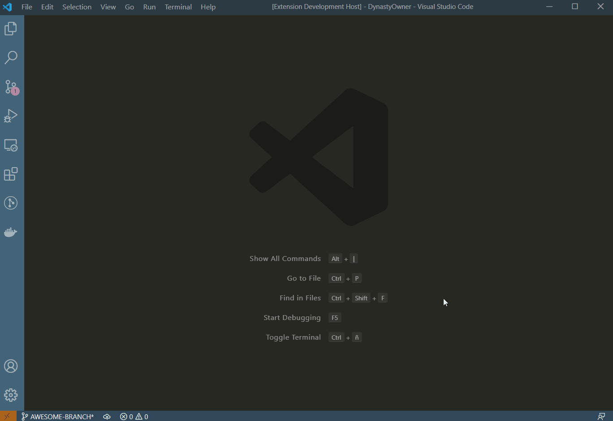

# AutoTerminal README

Welcome!
AutoTerminal allows you to setup different terminal arrangements.

If one of below usecases matches, then AutoTerminal is for you

- Need a terminal arrangement when performing task A, and another one when performing task B?
- Need to auto-start a terminal arrangement when opening a workspace?

## Features

## Extension Settings

Before starting you'll need to create an `autoTerminal.json` file in `.vscode` folder into your workspace. Or attempt to use the extension and you'll be prompt to use a mock setting.

AutoTerminal contributes the following specific `VSCode` settings:

From now on we'll refer to `autoTerminal.json` as `extensionSettings`:

- `autoTerminal.autoRun`: Enable/disable to runzfd
 the first command where `runOnStartUp` from `extensionSettings` is set to `true` command at `VSCode` start up.
- `autoTerminal.showHints`: Enable/disable the extension to show any message.
- `autoTerminal.closeOpenTerminals`: Enable/disable this behavior when running a command.

## Known Issues

- No issues until now. But feel free to [start a new issue](https://github.com/davidgcs11/autoTerminal/issues)

## Release Notes

### 1.0.0

Initial release of AutoTerminal
